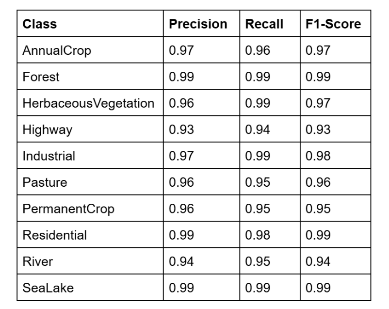

# Kolmogorov-Arnold Network for Satellite Image Classification in Remote Sensing

## Overview
The rapid growth of remote sensing technologies has resulted in high-resolution datasets essential for environmental monitoring, urban planning, agriculture, and disaster management. Traditional deep learning models trained on these datasets often require large computational resources, longer training times, and risk overfitting due to the high complexity of satellite images.

To address these challenges, this project explores **Kolmogorov-Arnold Networks (KAN)**, which replace traditional MLP heads with learnable **B-spline activation functions**. This architecture enhances model flexibility, reduces parameter overhead, and improves generalization. The proposed approach integrates KAN with ConvNeXt and compares its performance against other pre-trained models such as **MobileNetV2**, **EfficientNet-B0**, and **Vision Transformer (ViT)**.

---

## Objectives
1. Implement the **Kolmogorov-Arnold Network (KAN)** to replace the traditional MLP heads in ConvNeXt and other pre-trained models.
2. Evaluate the effectiveness of KAN on remote sensing classification tasks.
3. Compare performance metrics (accuracy, generalization, and parameter efficiency) across different models and datasets.

---

## Kolmogorov-Arnold Representation Theorem
The Kolmogorov-Arnold theorem states that any multivariate continuous function can be represented as a finite composition of continuous functions of a single variable. 

**Role in KAN:**
- KAN implements this theoretical foundation using **learnable activation functions** modeled via **B-splines**.
- B-spline functions are parameterized and trained during the learning process, allowing the network to adaptively learn complex functional relationships.

### Key Features of KAN Implementation:
- **Basis Functions**: SiLU (Sigmoid Linear Unit) activation.
- **B-spline Functions**: Learnable coefficients enabling adaptive activation behavior tailored to the dataset.

---

## Model Architecture
The project integrates KAN with ConvNeXt and other pre-trained models (ResNet101, MobileNetV2, EfficientNet-B0, ViT) for comparison.

- **KAN-ConvNeXt (KCN)**: The traditional MLP classifier in ConvNeXt is replaced with **two KANLinear layers**.
- **KANLinear Layer**: Combines learnable B-splines and basis functions to achieve parameter efficiency and improved performance.

---

## Dataset
### EuroSAT Dataset
- A remote sensing dataset consisting of **10 classes**:
  - Annual crop
  - Forest
  - Herbaceous vegetation
  - Highway
  - Industrial
  - Pasture
  - Permanent crop
  - Residential
  - River
  - Sea/Lake
- **Data Split**:
  - **70%** Training
  - **30%** Testing

---

## Results 

### Evaluation metrics for KCN

## Patch-Based Classification

In scenarios where high-resolution satellite images or similar large datasets are involved, analyzing the entire image at once can become difficult and computationally expensive. **Patch-based classification** provides a solution by dividing the image into smaller, manageable patches for localized analysis, followed by aggregating the results.

### Methodology
#### Patch Generation
- Input images are split into smaller, **non-overlapping patches** of a predefined size (e.g., **64×64 pixels**).
- This preprocessing step allows localized feature extraction, reducing computational overhead while preserving spatial information.
- Each patch is processed **independently** before results are aggregated for classification.

#### Model Architecture
The **ConvNeXtKAN** model serves as the backbone for the patch-based pipeline:
1. **ConvNeXt Backbone**:
   - The pre-trained **ConvNeXt Tiny** model is used for **feature extraction**.
   - Initial downsampling stride is modified to handle smaller patches, ensuring efficient feature representation for high-resolution inputs.
2. **KAN Layers**:
   - Two fully connected **KANLinear layers** are integrated into the model.
   - These layers enhance the attention mechanisms and improve feature aggregation, ultimately boosting classification accuracy.
3. **Patch Aggregation**:
   - Features from individual patches are **averaged** across all patches in an image.
   - The aggregated features represent the **global information** for final classification.

### Dataset and Preprocessing
#### High-Resolution Dataset
- **UC Merced Land Use Dataset**:
  - Consists of **21 classes** with **100 images per class**.
  - Each image has a resolution of **256×256 pixels**.

#### Data Split
- **70%** Training
- **30%** Testing

### Evaluation metrics

### Acknowledgments

https://www.researchgate.net/publication/381125655_Kolmogorov-Arnold_Network_for_Satellite_Image_Classification_in_Remote_Sensing
https://www.researchgate.net/publication/319463676_EuroSAT_A_Novel_Dataset_and_Deep_Learning_Benchmark_for_Land_Use_and_Land_Cover_Classification
http://weegee.vision.ucmerced.edu/datasets/landuse.html
